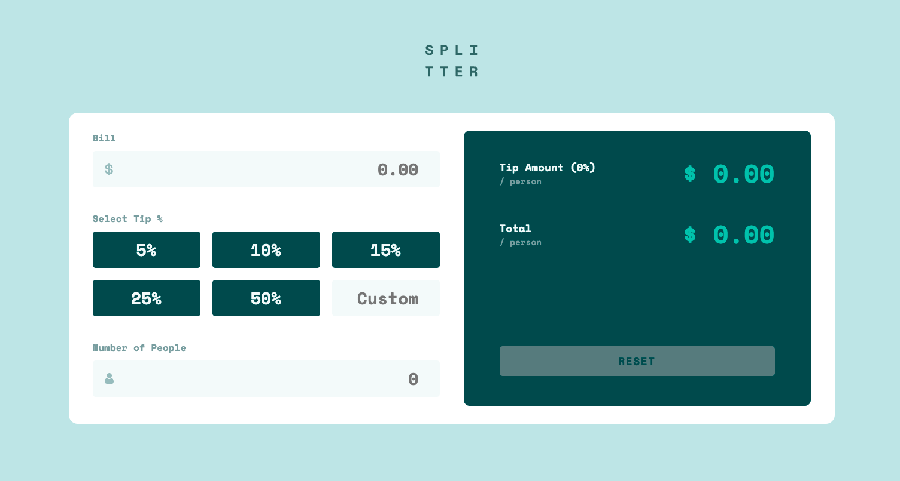
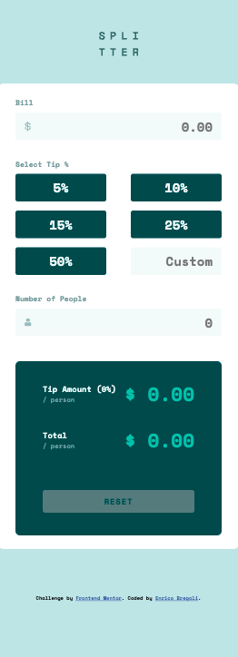

# Tip Calculator App | Frontend Mentor Challenge Solution

This is a solution to the [Tip Calculator App challenge on Frontend Mentor](https://www.frontendmentor.io/challenges/advice-generator-app-QdUG-13db). Frontend Mentor challenges help you improve your coding skills by building realistic projects.

## Table of contents

- [Overview](#overview)
  - [Advice Generator App](#The-challenge)
  - [Screenshot](#screenshot)
  - [Links](#links)
- [Useful resources](#useful-resources)
- [Author](#author)

## Overview

### The challenge

Users should be able to:

- View the optimal layout for the app depending on their device's screen size
- See hover states for all interactive elements on the page
- Generate a new tip by clicking the button

### Screenshots

### Links

- Solution URL: [GitHub](https://github.com/EnricoBreg/Tip_Calculator_App.git)
- Live Site URL: [Netlify](https://6262e698bd01fb11e7273315--statuesque-empanada-7ce17d.netlify.app/)

### Built with

- Semantic HTML5 markup
- CSS custom properties
- Flexbox
- Javascript Vanilla (DOM Manipulation)

## Useful resources

- [JavaScript DOM Crash Course (by TraversyMedia)](https://www.youtube.com/watch?v=0ik6X4DJKCc) - This helped me for DOM Manipulation in Vanilla Javascript. I really liked this video and Brad Traversy is one of my mentor :).

## Author

- Website - [Enrico Bregoli](https://www.your-site.com)
- Frontend Mentor - [@EnricoBreg](https://www.frontendmentor.io/profile/EnricoBreg)
- LinkedIn - [Enrico Bregoli](https://www.linkedin.com/in/enrico-bregoli/)
